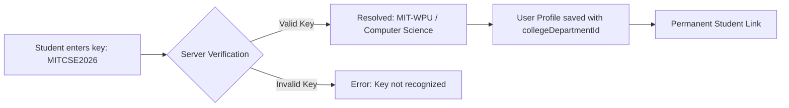

# CybersecQuizzer: User & Administrator Guide

Welcome to the **CybersecQuizzer** User & Administrator Guide. This guide covers everything you need to know about navigating the application as a **Student**, managing your department or college as an **Administrator**, or overseeing institutional operations as a **Super Administrator**.

---

## Table of Contents

1. [System Overview](#1-system-overview)
2. [User Roles & Permission Matrix](#2-user-roles--permission-matrix)
3. [Student Guide](#3-student-guide)
   - [Daily Quiz Participation](#daily-quiz-participation)
   - [5-Day Grace Period & Profile Requirements](#5-day-grace-period--profile-requirements)
   - [Setting Registration Key & Password](#setting-registration-key--password)
   - [Leaderboards & Reports](#leaderboards--reports)
4. [Department & College Admin Guide](#4-department--college-admin-guide)
   - [Admin Authentication](#admin-authentication)
   - [Registration Key Management](#registration-key-management)
   - [Data Isolation & Scoped Reporting](#data-isolation--scoped-reporting)
   - [Question Bank Management](#question-bank-management)
5. [Super Admin Guide](#5-super-admin-guide)
   - [College & Department Provisioning](#college--department-provisioning)
   - [Admin User Provisioning](#admin-user-provisioning)
   - [Global Analytics & System Maintenance](#global-analytics--system-maintenance)
6. [Registration Key Lifecycle & Architecture](#6-registration-key-lifecycle--architecture)
7. [Troubleshooting & Frequently Asked Questions (FAQ)](#7-troubleshooting--frequently-asked-questions-faq)

---

## 1. System Overview

**CybersecQuizzer** is an institutional daily micro-learning platform designed to build persistent cybersecurity hygiene among college students.

- **One Challenge Daily**: Students receive strictly one timed challenge per day (Monday to Friday, 10:00 AM – 9:00 PM IST).
- **Speed & Early Bird Bonuses**: Maximize points by answering early in the morning and responding swiftly.
- **Institutional Hierarchy**: Students are linked to specific Colleges and Academic Departments through **Registration Keys**, enabling granular performance analytics, department comparisons, and risk identification.

---

## 2. User Roles & Permission Matrix

| Feature / Capability | Student | Department Admin | College Admin | Super Admin |
| :--- | :---: | :---: | :---: | :---: |
| **Attempt Daily Quiz** | ✅ | ❌ | ❌ | ❌ |
| **View Personal Report** | ✅ | ❌ | ❌ | ❌ |
| **View Institutional Leaderboards** | ✅ | ✅ | ✅ | ✅ |
| **Manage Question Bank** | ❌ | ✅ | ✅ | ✅ |
| **View Department Student Reports** | ❌ | ✅ (Own Dept Only) | ✅ (All College Depts) | ✅ (Global) |
| **View Registration Key** | ❌ | ✅ (Own Dept) | ✅ (All College Depts) | ✅ (Global) |
| **Rotate / Change Registration Key** | ❌ | ✅ (Own Dept) | ✅ (All College Depts) | ✅ (Global) |
| **Create New Departments & Keys** | ❌ | ❌ | ✅ (Own College) | ✅ (Global) |
| **Create / Manage Colleges** | ❌ | ❌ | ❌ | ✅ |
| **Create / Manage Admin Users** | ❌ | ❌ | ❌ | ✅ |
| **Reset Leaderboard** | ❌ | ✅ | ✅ | ✅ |

---

## 3. Student Guide

### Daily Quiz Participation
1. Visit the home screen during active hours (**10:00 AM – 9:00 PM IST**, Monday–Friday).
2. Enter your unique **Nickname** or log in with your credentials.
3. Answer the daily multiple-choice challenge before the 30-second countdown expires.
4. Review your instant score, response time, and detailed cybersecurity explanation.

### 5-Day Grace Period & Profile Requirements
- **First 5 Days (Grace Period)**: New students can jump right into the quiz immediately using just their nickname.
- **After Day 5 (Mandatory Completion)**: To ensure institutional verification and score integrity, accounts older than 5 days are required to complete their profile before attempting subsequent quizzes.

```
[ Day 0: Account Created ] ───► [ 5-Day Grace Period: Play Immediately ]
                                          │
                                          ▼
                             [ Day 5+: Profile Required ]
                             ├── 1. Valid Registration Key (from Admin)
                             └── 2. Secure Student Password (8+ chars)
```

### Setting Registration Key & Password
1. Navigate to the **Profile** page (`/profile`).
2. Enter your **Full Name** and **Email Address**.
3. In the **Registration Key** field, type the key provided by your department administrator (e.g., `MITCSE2026`).
4. The system will automatically resolve and display your **College** and **Department**.
5. Configure a secure **Password** (minimum 8 characters, containing at least 1 uppercase letter, 1 lowercase letter, and 1 number).
6. Click **Save Profile**. Your profile is now permanently linked to your department.

### Leaderboards & Reports
- **Leaderboard (`/leaderboard`)**: Compare scores daily, weekly, monthly, or all-time against peers in your department, college, or globally.
- **My Report (`/report`)**: Review your personal accuracy, response speed trends, category strengths/weaknesses, and active streaks.

---

## 4. Department & College Admin Guide

### Admin Authentication
1. Navigate to `/admin` or click **Admin Login** in the footer.
2. Enter your authorized admin email address and password.
3. Upon login, your top badge will display your authorized **College** and **Department** scope.

### Registration Key Management
Admins have access to a dedicated **Registration Keys** tab:
1. Click on the **Registration Keys** tab in the admin navigation bar.
2. View your current active registration key (e.g., `MITCSE2026`).
3. Click **Copy Key** to copy the code to your clipboard for distribution to students.
4. To update or rotate the key:
   - Click **Change Key**.
   - Enter the new custom string (e.g., `MITCSE2027` or `CSE-FALL26`).
   - Click **Save New Key**.

> [!IMPORTANT]
> **Permanent Student Association**: Changing or rotating a registration key **only affects future student registrations**. All existing students who registered with the old key remain permanently attached to your department with zero loss of quiz history or scores.

### Data Isolation & Scoped Reporting
Administrators only have access to data within their designated institutional boundaries:
- **Department Admins**: View reports, attempt records, risk analyses, and student metrics **strictly for their own department**.
- **College Admins**: View combined reports across all departments within their college, with department filter breakdowns.
- **Tampering Protection**: Department admins cannot modify registration keys or view metrics belonging to other departments.

### Question Bank Management
- **Add Question**: Click `+ Add Question` to submit a new challenge with 4 options, category, difficulty, and educational explanation.
- **Toggle Active/Disabled**: Enable or disable questions in real time.
- **Bulk Operations**: Select multiple questions to bulk enable, disable, delete, or export to JSON.

---

## 5. Super Admin Guide

Super Administrators manage platform-wide configuration across all educational institutions.

### College & Department Provisioning
1. Access the **Super Admin Console** at `/super-admin`.
2. Under **Colleges**, click **+ Add College** to register a new institution (e.g., `MIT - WPU University Pune`).
3. Under **Departments & Registration Keys**, add departments under the college and assign unique registration keys (e.g., `MITCSE2026`, `MITIT2026`).

### Admin User Provisioning
1. In the Super Admin console, navigate to **Admin Users**.
2. Click **+ Add Admin**.
3. Enter the administrator's email, name, and temporary password.
4. Select the target **College** and target **Department** (or leave department blank for a college-wide admin).
5. Click **Create Admin**.

### Global Analytics & System Maintenance
- Super Admins can monitor cross-institutional participation, global question bank performance, and platform engagement trends.
- Leaderboards can be reset seasonally or per academic semester.

---

## 6. Registration Key Lifecycle & Architecture

### What is a Registration Key?
A registration key is an authoritative, human-readable code that maps a student to a specific college and academic department.
- **Format Flexibility**: Registration keys are **NOT** passwords. They can be simple alphanumeric strings (e.g., `MITCSE2026`, `COEPCSE`, `ABCMECH-1`).
- **One Key per Department**: Each department has one active registration key at any given time.
- **Server Verification**: The backend verifies registration keys in real time when students enter them in `/profile`.



---

## 7. Troubleshooting & Frequently Asked Questions (FAQ)

### Q1: A student entered their registration key, but it says "Invalid key".
- **Resolution**: Verify that the student entered the exact key without spelling errors. Ask the department admin to check their **Registration Keys** tab in `/admin` to confirm the currently active key.

### Q2: An admin changed the department registration key. Will existing students lose access?
- **Resolution**: **No.** Student association is stored permanently via database IDs (`collegeDepartmentId`). Changing the registration key only changes what new incoming students must enter.

### Q3: Why is a student blocked with "Profile Completion Required"?
- **Resolution**: The student account is older than 5 days and has not yet completed the two mandatory fields:
  1. Department Registration Key
  2. Student Password (minimum 8 characters, 1 uppercase, 1 lowercase, 1 number)
  Direct the student to `/profile` to complete their setup.

### Q4: Can a student switch to a different department?
- **Resolution**: Yes. The student can navigate to `/profile`, enter the new department's registration key, and click **Save Profile**.

### Q5: Can a Department Admin see students from other departments?
- **Resolution**: No. All admin reports and statistics enforce strict database-level scoping based on the admin's assigned `collegeDepartmentId`.

---

*CybersecQuizzer Documentation — Version 2.4.0*
